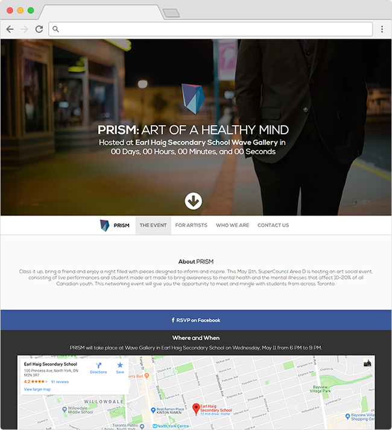

# PRISM: TDSB SuperCouncil Area D Initiative 2016 Website
While I was in high school during the fall of 2015, this static website was developed to promote the TDSB SuperCouncil Area D Initiative. I used my basic knowledge of HTML, CSS, and JavaScript to build this website. Later on, I was introduced to frameworks like Bootstrap which helped me design and develop websites much quicker.

View the website here: https://alvintang.me/dprism/

